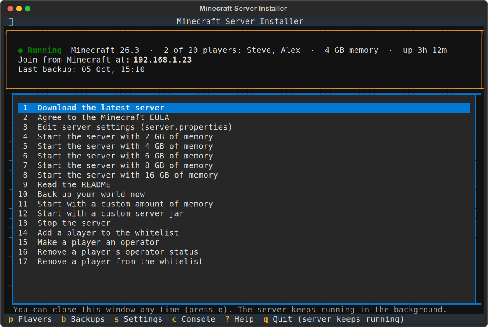
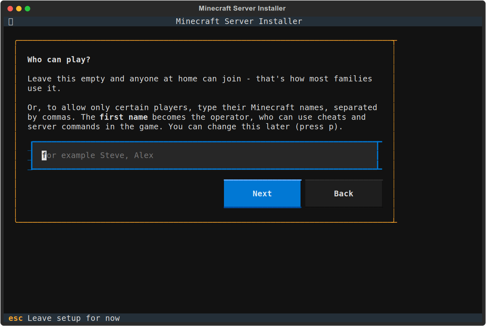
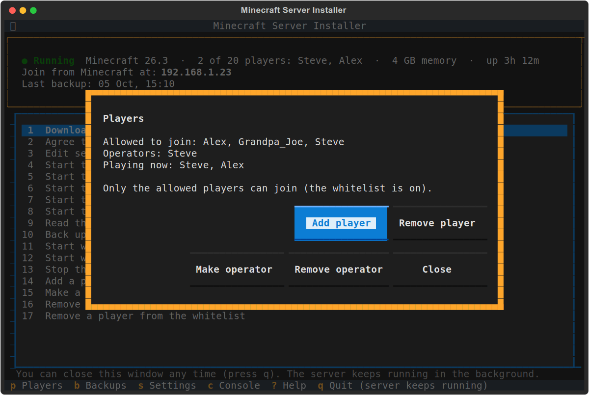
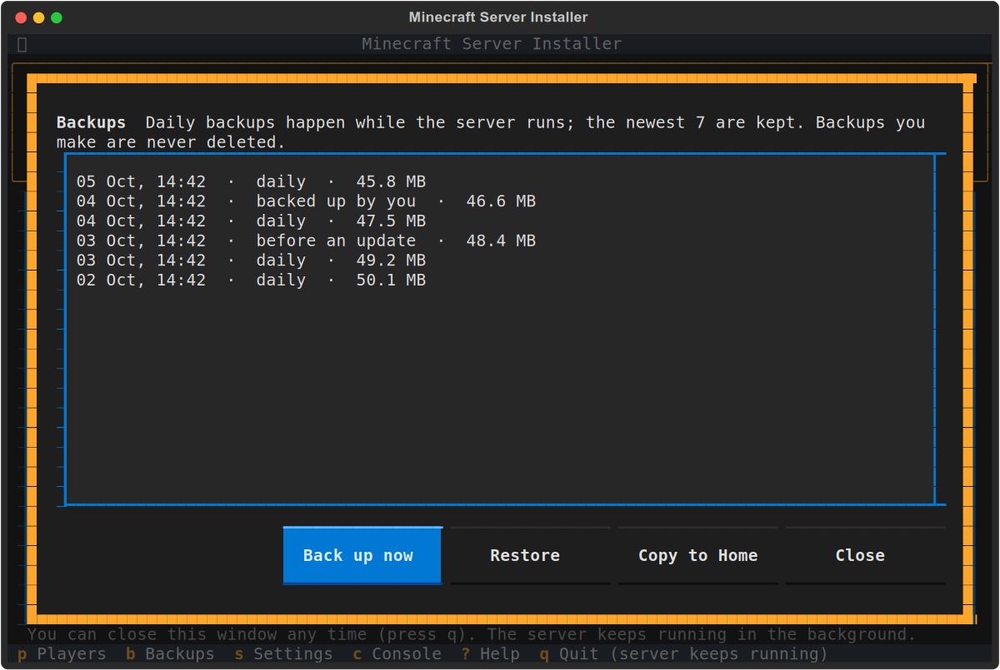
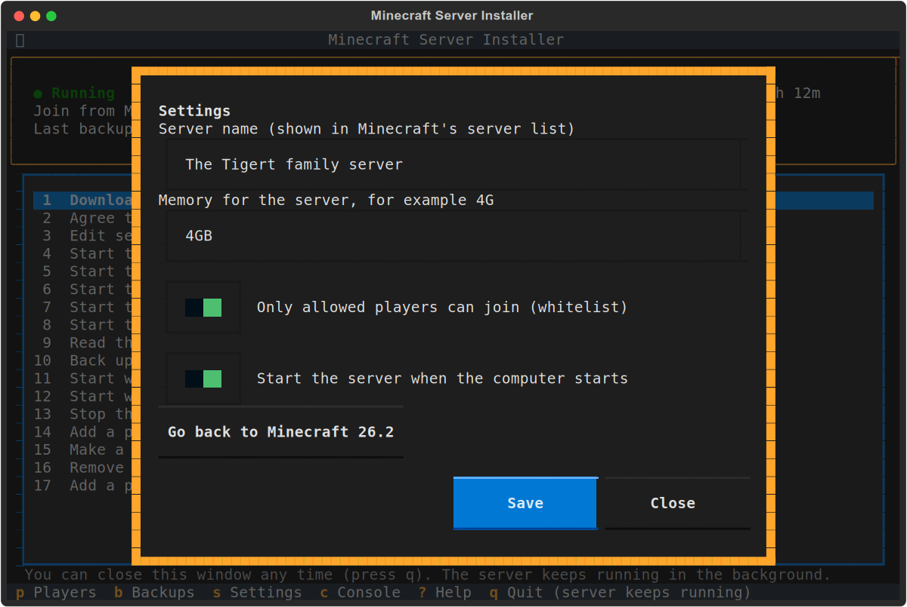

[](https://snapcraft.io/mc-server-installer)[](https://github.com/kz6fittycent/mc-server-installer/actions?query=workflow:"🧪+Snap+Builds")[](https://github.com/kz6fittycent/mc-server-installer/actions/workflows/periodic_builds.yml)

#### If you like what I'm doing, please consider supporting me on Patreon!
[](https://www.patreon.com/kz6fittycent)

# Minecraft Server Installer

Run your own **Minecraft: Java Edition** server at home, so the whole family can
play together in one world. A short setup gets it going, and it keeps running in
the background - close the window, log out, or restart the computer, and the
server is still there.



Built from scratch by [kz6fittycent](https://github.com/kz6fittycent) under the MIT License.
More help is in the [wiki](https://github.com/kz6fittycent/mc-server-installer/wiki).

**Note:** this is not an official Minecraft product, and is not approved by or
associated with Mojang or Microsoft. You must agree to the
[Minecraft EULA](https://aka.ms/MinecraftEULA) to run a server.

## Install

```
sudo snap install mc-server-installer
```

Then open a terminal and run:

```
mc-server-installer
```

## First run

The first time, a short setup asks a few questions - a name for your server and
how much memory it may use (it suggests an amount for your computer) - then
downloads Minecraft and starts the server. Anyone at home can join; if you'd
rather allow only certain players, the setup lets you name them.



When it is done, it shows the address to use. On every computer that should
play: open Minecraft, choose **Multiplayer**, then **Add Server**, and type that
address.

## It keeps running

The server runs in the background, looked after by your computer:

- Close the menu (press **q**) whenever you like. The server keeps running.
- Log out, or lose your SSH connection: the server keeps running.
- Restart the computer: the server comes back by itself, if it was running
  (you can turn this off in Settings).
- When the snap updates itself, the server stops cleanly - the world is saved
  first - and comes straight back.

## Everyday use

| Key | Does what |
| --- | --- |
| **p** | **Players**: who may join, who is an operator, who is playing now |
| **b** | **Backups**: back up now, restore, or copy a backup to your Home folder |
| **s** | **Settings**: server name, memory, whitelist, start with the computer |
| **c** | **Console**: the server's live log, and a box for server commands such as `say Dinner time!` |
| **u** | **Update**: shown when a new Minecraft is out |
| **?** | Help |
| **q** | Quit the menu - the server keeps running |

The numbered options 1 to 17 are the same as in earlier versions, in the same
order. Type the number (for two digits, type them quickly: **1** then **3**
for 13) or click.



### Backups

- **Daily**, while the server runs. The newest 7 are kept.
- **Before every update and every restore**, automatically.
- **Whenever you like**: option 10, or **Back up now** in Backups. These are
  never deleted automatically, and a copy is put in your Home folder.

Restoring a backup first backs up the world as it is now, so you can always go
back.



### Minecraft updates

Players' Minecraft updates itself, and an older server then turns them away.
When a new version is out, the top of the menu says so. Press **u**: the world is
backed up, the server updates and restarts. Settings can go back to the previous
version.

### Settings



## Who can change the server

The person who sets the server up on a computer is its owner. Other people on
that computer can open the menu and see how the server is doing, but only the
owner can start, stop or change it. To hand it over to someone else:

```
sudo mc-server-installer.ctl set-owner user=THEIR_LOGIN_NAME
```

## Moving from an older version

Your world comes with you. The first time you open the menu after updating, it
offers to move your world, whitelist, operators and settings over to the new
background server. The original files stay where they were, as a backup.

## Playing with friends outside your home

The server is reachable by anyone on your home network. To let friends join over
the internet, forward **TCP port 25565** on your router to this computer, and
give them your public IP address. First turn the whitelist on (Settings, **s**)
and add each player (**p**), so only the players you added can join. (A guided setup for this is planned for a later version.)

## Where things are

- The server's files: `/var/snap/mc-server-installer/common/server`
- Backups: `/var/snap/mc-server-installer/common/backups`
- The background service's log: `sudo snap logs mc-server-installer.service`

## Troubleshooting

- **"The background service is not running"**: run
  `sudo snap restart mc-server-installer`, then open the menu again.
- **Players can't join**: check that their Minecraft version matches the server's
  (the top of the menu), that they typed the address shown there, and that they
  are on the whitelist (press **p**).
- **The server stopped twice by itself**: the menu shows why. Press **c** to read
  the end of the server's log.

## Contributing

Fork the repo, make changes, and submit a pull request on
[GitHub](https://github.com/kz6fittycent/mc-server-installer). Issues and
suggestions welcome!
